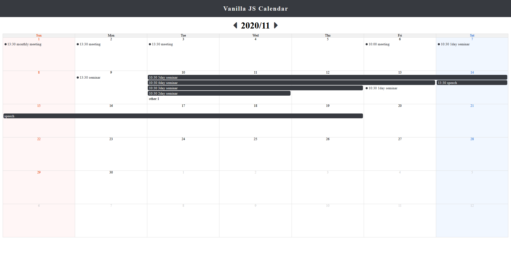
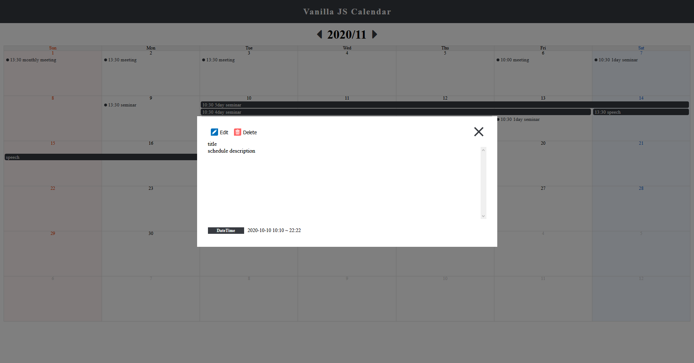
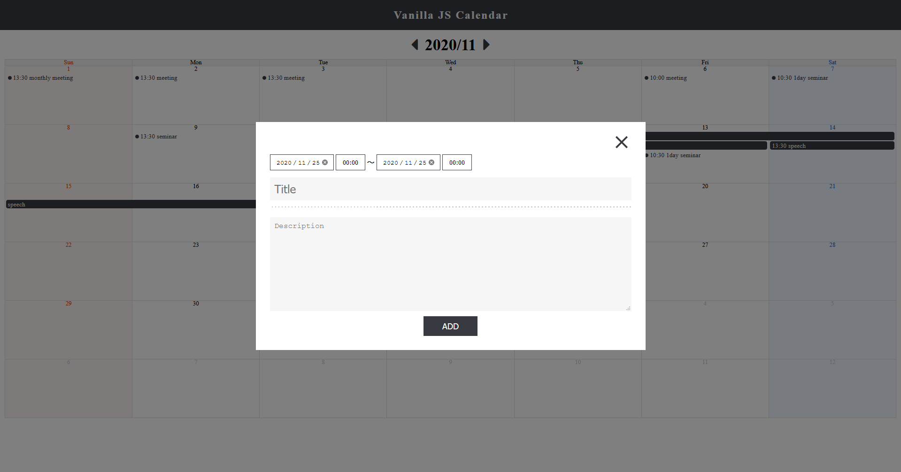
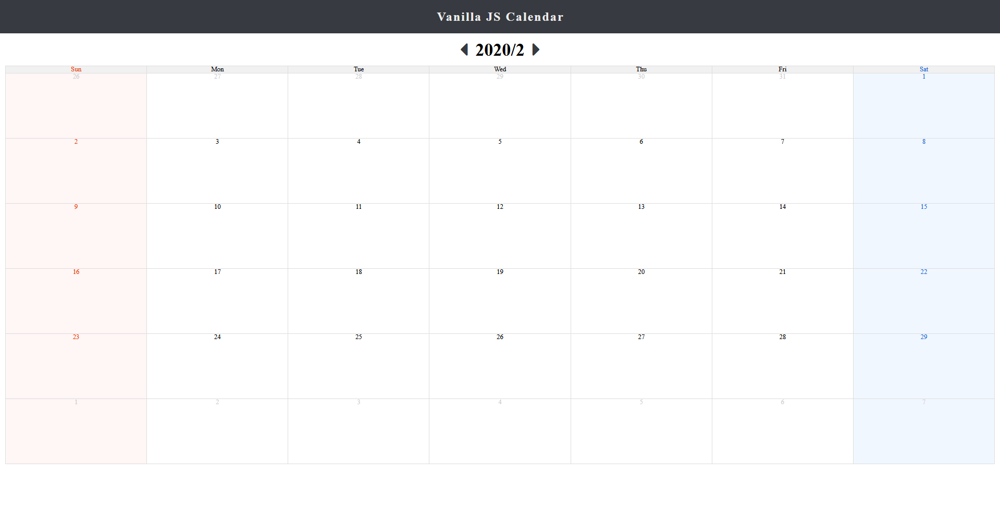

haruhiko-zht/vanilla-js-calendar
===

vanilla js calendar

This js calendar was created for my studying in 2019, so this calendar is not maintenance.

## Demo

Sample image when developing.

## Requirement

- Moment.js  
  'Moment.js' is ending development, so you should use other datetime js library.  
  I think 'Day.js' is similar 'Moment.js'.

## Author

[haruhiko-zht](https://github.com/haruhiko-zht)
